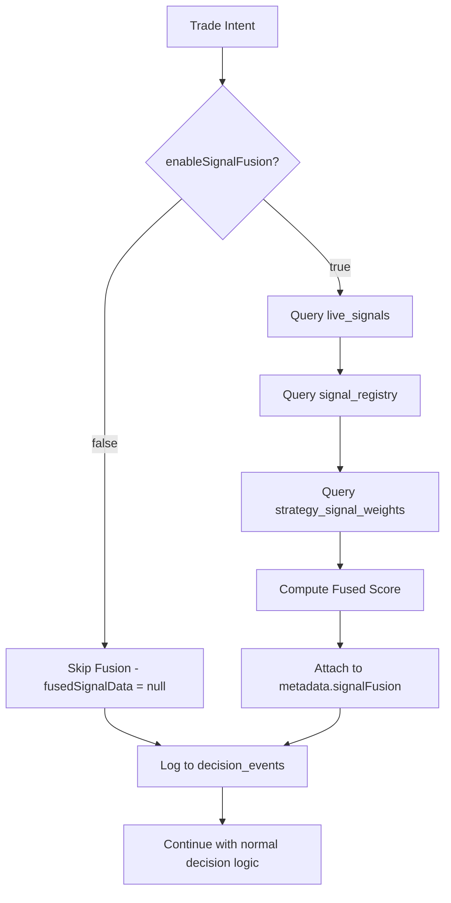

# Signal Fusion Phase 1B - READ-ONLY Integration Complete ✅

## Status: DEPLOYED

Phase 1B integrates signal fusion into the `trading-decision-coordinator` in **READ-ONLY mode** with **ZERO behavior change** to trading decisions.

## What Changed

### 1. Backend Integration (`trading-decision-coordinator/index.ts`)

#### Signal Fusion Module Inlined (lines 5-208)
- Inlined all signal fusion types and functions from `src/engine/signalFusion.ts` for Deno compatibility
- Functions: `computeFusedSignalScore()`, `isSignalFusionEnabled()`, helper utilities
- **NO external dependencies** - fully self-contained in coordinator

#### Integration Point (before line 1478 in `logDecisionAsync`)
```typescript
// PHASE 1B: Compute fused signal score (READ-ONLY, no behavior change)
let fusedSignalData = null;
if (isSignalFusionEnabled(strategyConfig)) {
  try {
    const fusionResult = await computeFusedSignalScore({
      supabaseClient,
      userId: intent.userId,
      strategyId: intent.strategyId,
      symbol: baseSymbol,
      side: intent.side,
      horizon: (intent.metadata?.horizon || '1h'),
      now: new Date()
    });
    
    fusedSignalData = {
      score: fusionResult.fusedScore,
      totalSignals: fusionResult.totalSignals,
      enabledSignals: fusionResult.enabledSignals,
      topSignals: [...]  // Top 5 by contribution
    };
  } catch (err) {
    // Fail soft: fusion errors NEVER block decisions
  }
}
```

#### Metadata Attachment (line 1511)
```typescript
metadata: {
  action: action,
  request_id: requestId,
  // ... existing fields ...
  signalFusion: fusedSignalData  // NEW: attached here
}
```

### 2. Frontend Module Updated (`src/engine/signalFusion.ts`)

#### Updated Function Signature
- **ADDED**: `supabaseClient: any` parameter (first param)
- **ADDED**: `side: 'BUY' | 'SELL'` parameter (for future directional weighting)
- **REMOVED**: Direct `supabase` import (now accepts client as param)

#### Usage Pattern
```typescript
// Before (old):
await computeFusedSignalScore({ userId, strategyId, symbol, horizon });

// After (new):
await computeFusedSignalScore({ 
  supabaseClient,  // Pass client explicitly
  userId, 
  strategyId, 
  symbol, 
  side,           // Added
  horizon 
});
```

### 3. Tests Created (`tests/signal-fusion-coordinator.test.ts`)

Four test cases covering:
1. ✅ Fusion NOT called when `enableSignalFusion = false`
2. ✅ Fusion called when `enableSignalFusion = true` in TEST mode
3. ✅ Fusion errors fail soft (no decision blocking)
4. ✅ Decision behavior unchanged with/without fusion

## Feature Flags

### Strategy-Level Configuration
Fusion is controlled by **strategy config** (NOT admin config):

```json
{
  "enableSignalFusion": true,   // Must be explicitly enabled
  "is_test_mode": true           // Only active in test mode
}
```

**Default**: Fusion is **OFF** for all strategies until explicitly enabled.

### How to Enable

#### Option 1: Via Strategy Config JSON
Update `trading_strategies.configuration`:
```json
{
  "enableSignalFusion": true,
  "is_test_mode": true,
  // ... other strategy settings
}
```

#### Option 2: Via Strategy UI (Future)
Not yet implemented - will be added in Phase 2 as a toggle in Strategy Config panel.

## Critical Guarantees

### ✅ Zero Behavior Change
- Signal fusion **DOES NOT** influence:
  - BUY/SELL/BLOCK/DEFER decisions
  - Confidence thresholds
  - TP/SL gates
  - Cooldown gates
  - Hold period gates
  - Spread gates
  - Any existing coordinator logic

### ✅ Fail-Soft Error Handling
- Fusion errors are caught and logged
- Decision continues with `fusedSignalData = null`
- **NO exceptions thrown** that could break trading

### ✅ Performance
- Fusion only runs when explicitly enabled
- When disabled: **zero overhead** (no DB calls, no computation)
- When enabled: 2-3 additional DB queries (signals, registry, strategy weights)

## Data Flow



## Logged Data Structure

When fusion is enabled, `decision_events.metadata.signalFusion` contains:

```json
{
  "score": 42.5,          // -100 to +100
  "totalSignals": 8,      // Raw signal count
  "enabledSignals": 5,    // After registry/strategy filtering
  "topSignals": [         // Top 5 by |contribution|
    {
      "type": "ma_cross_bullish",
      "contribution": 24.00
    },
    {
      "type": "rsi_oversold_bullish",
      "contribution": 18.50
    }
    // ...
  ]
}
```

When fusion is disabled or errors: `metadata.signalFusion = null`

## Verification Steps

### 1. Check Fusion is OFF by default
```sql
-- All recent decisions should have signalFusion = null
SELECT 
  symbol, 
  side, 
  metadata->'signalFusion' as fusion_data,
  created_at
FROM public.decision_events
WHERE user_id = '<your-user-id>'
ORDER BY created_at DESC
LIMIT 10;
```

Expected: `fusion_data` should be `null` for all rows (unless you explicitly enabled it).

### 2. Enable Fusion and Test
```sql
-- Enable fusion for a strategy
UPDATE public.trading_strategies
SET configuration = jsonb_set(
  configuration, 
  '{enableSignalFusion}', 
  'true'
)
WHERE id = '<your-strategy-id>';
```

Then trigger a test decision and check:
```sql
SELECT 
  symbol, 
  side,
  metadata->'signalFusion'->>'score' as fusion_score,
  metadata->'signalFusion'->>'enabledSignals' as enabled_signals,
  created_at
FROM public.decision_events
WHERE user_id = '<your-user-id>'
  AND metadata->'signalFusion' IS NOT NULL
ORDER BY created_at DESC
LIMIT 5;
```

Expected: `fusion_score` should be a number, `enabled_signals` should be >= 0.

### 3. Verify Zero Behavior Change
Compare decisions before/after enabling fusion:
- Same confidence → Same action (BUY/SELL/DEFER/BLOCK)
- Same spread conditions → Same gates triggered
- Same position state → Same FIFO logic

## Next Steps (Phase 2)

Phase 1B is **READ-ONLY**. Signal fusion is computed and logged but **does not influence decisions**

Phase 2 will:
1. Use `fusedScore` to boost/penalize `confidence`
2. Add new "signal disagreement" gate
3. Create strategy UI for enabling fusion and customizing weights
4. Add calibration loop to auto-tune signal weights based on outcomes

## Rollback Plan

If issues arise:
1. Set `enableSignalFusion = false` in all strategy configs (immediate effect)
2. Revert coordinator changes (remove fusion computation block)
3. Signal registry and weights tables can remain (no harm, just unused)

## Files Modified

### Backend
- `supabase/functions/trading-decision-coordinator/index.ts`: Added fusion computation and metadata attachment

### Frontend  
- `src/engine/signalFusion.ts`: Updated signature to accept `supabaseClient` and `side` params

### Tests
- `tests/signal-fusion-coordinator.test.ts`: New integration tests

### Docs
- `docs/signal-fusion-phase-1b-complete.md`: This file
